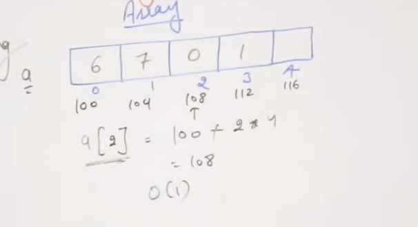
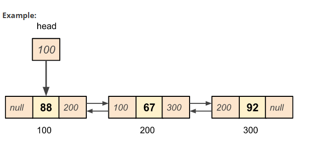
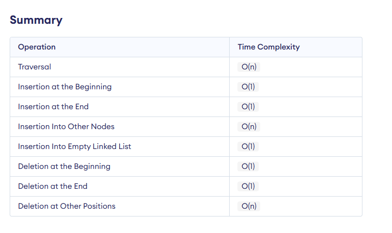

# Array vs Linked Lists

## Array
- Const of accessing O(1) with the help of indexes
- Fixed size
- Possible of storing unused spaces, (array capacity is 6 but only 4 are filled so 2 is unused)
  

-
## Singly Linked List
> Head pointer - stores address of first node

- Const of accessing O(n), it traverses consequently from head to tail
- Dynamic size
- Stores 2X spaces compared to array(value and pointer)(take 4 bytes per item)
  

-
## Time Compexity

-
## Doubly Linked List
- Stores 3x spaces compared to array per item(prevPointer, value, nextPointer)(take 4 bytes per item)

-

- ### Time Complexity
  

-

 ## Circular Linked List

 ## Circular Doubly Linked List

-

