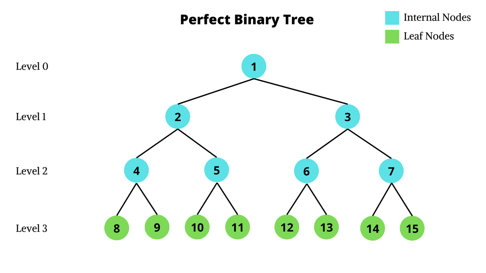
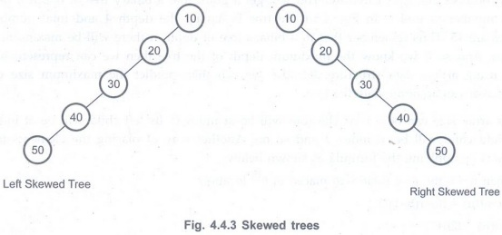
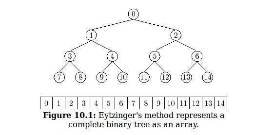

# Trees
>## *Tree* - non-linear data structure that represents hierarchy structure
>## Top most node in hierarchy is *root* node
>## Previous node to particular node is a *parent* node(one upper level node)
>## Immediate successor is a *child* node(one lower level node)
>## *Leaf Node* is a node that has no child node(or external node)
>## *Non Leaf Node* is a node that has child node(or internal node)
>## *Edge* is length between two nodes
>## *Ancestor* is any node that is in upper level, connected by a path upwards from specific node till root 
>## *Descendant* is any node that is in lower level, connected by a path downwards from specific node till leaf node
>

# Binary Tree && Its types
>## *Binary Tree* when each node can have at most 2 children

-
>## *Full Binary Tree* - each node contains either 0 or 2 children except leaf nodes

-
>## *Complete Binary Tree* - where all nodes are filled except lowest level nodes(from left to right)

-
>## *Perfect Binary Tree* - all internal nodes have 2 children and all leaf nodes are in the same level

-
>## *Degenerate Binary Tree* - all nodes have only one child

-
# Array representation of binary tree
>> if a node is i-th index:
>>- left child would be at [(2*i) + 1]
>>- right child would be at [(2*i) + 2]
>>- parent node would be at [(i-1)/2]
>>

-
>- PS. *Make binary tree complete* to calculate properly

